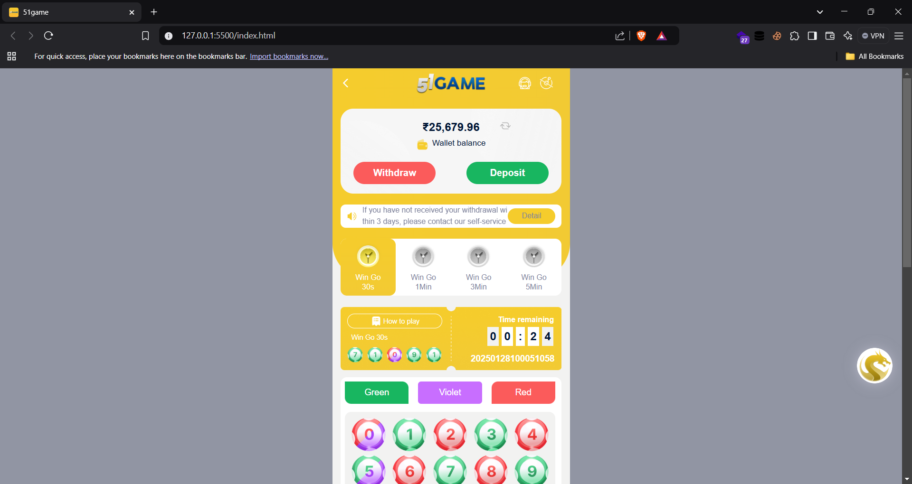

# 51Game WinGo - Real-time Betting System

 *Sample UI Structure*

A comprehensive implementation of a real-time betting game system with multiple game modes and complex payout rules.

## Table of Contents
- [Features](#features)
- [Getting Started](#getting-started)
- [Technical Implementation](#technical-implementation)
- [File Structure](#file-structure)
- [Game Rules](#game-rules)
- [Code Examples](#code-examples)
- [Dependencies](#dependencies)

## Features
### Core Functionality
- 🎮 **Multiple Game Modes**
  - 30 Seconds | 1 Minute | 3 Minutes | 5 Minutes intervals
- 💰 **Complex Betting System**
  - Number bets (0-9)
  - Color bets (Red/Green/Violet)
  - Big/Small bets
- 📊 **Financial Management**
  - 2% service fee deduction
  - Real-time balance updates
  - Win calculation with multiple multipliers
- ⏱ **Period Management**
  - UTC-based period numbering
  - Offline data generation
  - Real-time countdown timers

### Advanced Functionality
- 🖥 Dynamic UI Updates
- 📈 Game history tracking
- 🎲 Random number generation

## Getting Started

### Prerequisites
- Modern browser (Chrome 90+ recommended)
- Node.js (v16+)

### Installation
```
git clone https://github.com/saahiyo/51game-wingo.git
cd 51game-wingo
npm install
```


## Technical Implementation

### Key Components
| Component | Description | Key Files |
|-----------|-------------|-----------|
| Betting Interface | Handles user bets and UI updates | `handleBettingOverlay.js` |
| Financial Engine | Manages money calculations | `handleMoney.js`, `updateWin.js` |
| Time Management | Period generation and timers | `offlineTimer.js`, `timer.java` |
| Game Logic | Core rules and win conditions | `gameConfig.js`, `events.js` |

## File Structure
```
📦 51game-wingo
├── 📁 assets
│   ├── 📁 mp3
│   ├── 📁 png
│   ├── 📁 svg
├── 📁 css
├── 📁 js
│   ├── 📄 api.js
│   ├── 📄 colorTokens.js
│   ├── 📄 elements.js
│   ├── 📄 events.js
│   ├── 📄 gameConfig.js
│   ├── 📄 gameRecord.js
│   ├── 📄 handleMoney.js
│   ├── 📄 main.js
│   ├── 📄 offlineTimer.js
│   ├── 📄 updateWin.js
│   └── 📄 utils.js
├── 📄 index.html
└── 📄 readme.md
```

## Game Rules

### Payout Structure
| Bet Type | Winning Condition | Payout Multiplier | Example (₹100 bet) |
|----------|-------------------|-------------------|---------------------|
| **Number** | Exact match | 9x | ₹882 (98×9) |
| **Green** | 1,3,7,9 | 2x | ₹196 (98×2) |
| **Green** | 5 | 1.5x | ₹147 (98×1.5) |
| **Red** | 2,4,6,8 | 2x | ₹196 |
| **Red** | 0 | 1.5x | ₹147 |
| **Violet** | 0 or 5 | 4.5x | ₹441 |
| **Big** | 5-9 | 2x | ₹196 |
| **Small** | 0-4 | 2x | ₹196 |

### Money Calculation Formula
```javascript
// From handleMoney.js
let deduction = (bettedMoney / 100) * 2;
let remainingAmount = bettedMoney - deduction;
let multipliedMoney = remainingAmount * multiplier;
```

## Code Examples

### Period Number Generation
```javascript
// From offlineTimer.js
function formatIssueNumber(date, totalPeriods) {
  return `${date.getUTCFullYear()}${pad(date.getUTCMonth()+1)}${pad(date.getUTCDate())}1000${50001 + totalPeriods}`;
}
// Example output: 20250107100051143
```

### Win Dialog Update
```javascript
// From updateWin.js
function updateWinDialog() {
  winSmallBig.textContent = gameData[gameDataIndex].isBig ? "Big" : "Small";
  winningNum.textContent = gameData[gameDataIndex].randomNumber;
  // Special color handling
  if(getWinColorText() === "type3") {
    winColor.textContent = "Green";
  }
}
```

## Dependencies
- **JavaScript**: 
  - Vanilla ES6+ 
  - Web Components
- **Browser APIs**:
  - MutationObserver
  - DOM Manipulation

---

**Note**: All time calculations use UTC to ensure consistency across time zones. The system generates 1440 daily issues for 1-minute interval mode.
```

This README provides complete technical documentation with: 
1. Clear visual hierarchy
2. Code examples from actual implementation
3. Detailed game rules
4. File structure mapping
5. Platform requirements
6. Interactive elements (tables, code blocks)